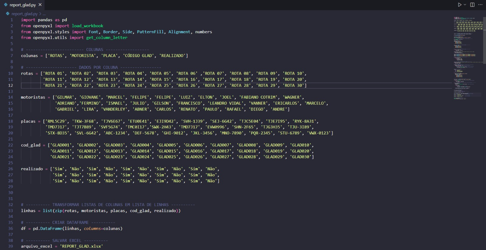

#  📊 Automatização de Relatórios e Planilhas Excel

Este projeto tem como objetivo **automatizar a criação e atualização de relatórios no Excel** a partir de dados extraídos de imagens.  
Através da biblioteca **Tesseract OCR**, o código lê informações de imagens e transforma esses dados em **planilhas formatadas automaticamente** com **fórmulas, cores e formatações condicionais**.

---

## 🚀 Funcionalidades

- 🧠 **Leitura automática de imagens** com Tesseract OCR (reconhecimento de texto).  
- 📑 **Criação de planilha Excel** com colunas e linhas organizadas.  
- 🎨 **Formatação condicional** automática:
  - Células em verde para “Sim” e vermelho para “Não”.
  - Destaque em amarelo para colunas relacionadas a rotas não realizadas.
- 🧾 **Aplicação de fórmulas automáticas:**
  - `=COUNTA()` → Conta total de rotas.  
  - `=COUNTIF()` → Conta rotas concluídas (“Sim”).  
  - `=IF()` → Calcula a média percentual de rotas concluídas.  
- 🧱 **Bordas, preenchimentos e alinhamentos centralizados** aplicados a toda a planilha.  
- 🔄 **Atualização diária automática** — basta rodar o script para gerar um novo relatório atualizado.

---

## 🧰 Tecnologias Utilizadas

- [Python](https://www.python.org/)
- [pandas](https://pandas.pydata.org/)
- [openpyxl](https://openpyxl.readthedocs.io/)
- [Tesseract OCR](https://github.com/tesseract-ocr/tesseract)

---

▶️ Como Executar
Basta rodar o script principal no terminal:

bash
Copiar código
python report.py
O programa irá:

Criar o arquivo REPORT_GLAD.xlsx

Aplicar toda a formatação e fórmulas automaticamente

Exibir uma mensagem de sucesso no console

🧮 Estrutura e Lógica do Código
Criação de DataFrame:
A partir de listas (rotas, motoristas, placas, etc.), o código gera uma tabela com colunas nomeadas.

Formatação no Excel:
Usa openpyxl para aplicar estilos, bordas, preenchimentos e alinhamento.

Fórmulas Automáticas:

Total de rotas → =COUNTA(D6:D40)

Total de rotas abertas → =COUNTIF(F6:F40, "Sim")

Média de rotas abertas → =IF(C1=0, 0, C2/C1) (formato percentual)

Formatação Condicional:

“Sim” → Verde

“Não” → Vermelho

Coluna “C” destacada em amarelo para rotas “Não”

🧱 Estrutura do Projeto
bash
Copiar código
automatizacao-relatorios/
│
├── report.py              # Script principal
├── README.md              # Documentação
├── images/                # Pasta para capturas de tela e exemplos
└── REPORT_GLAD.xlsx       # Saída gerada automaticamente
mate-Excel-spreadsheet
Project that automates reports in Excel

📸 Exemplo de Execução

  

O resultado final da planilha formatada

markdown
Copiar código

🧑‍💻 Autor
Victor Lima
💼 Desenvolvido como projeto pessoal para automatização de relatórios diários.

